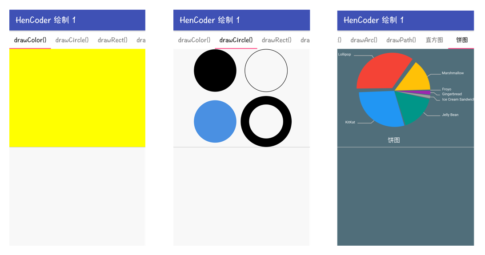
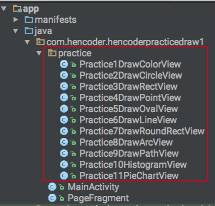
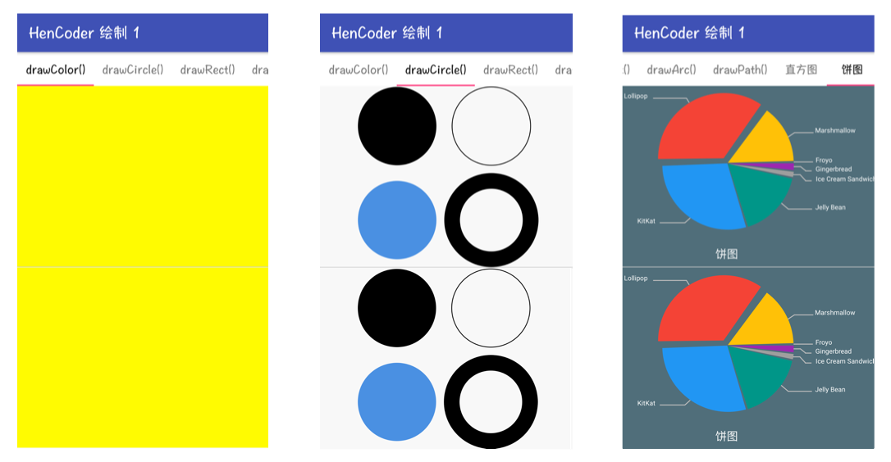

HenCoder 绘制 1 练习项目
===

### 这是什么？

这不是一个独立使用的项目，它是 [HenCoder Android 进阶分享：UI 1-1 绘制基础](http://hencoder.com/ui-1-1) 的配套练习项目。

### 怎么用？

项目是一个可以直接运行的 Android App 项目，项目运行后，在手机上打开是这样的：

工程下有一个 `/practice` 目录：

你要做的是就是，在 `/practice` 下的每一个 `PracticeXxxView.java` 文件中写代码，绘制出和页面上半部分相同的效果。例如写 `PracticeDrawColorView.java` 以绘制出 "drawColor()" 标签下的黄色涂色效果。就像这样：

> 当然，没必要做得和示例一毛一样。这是一个练习，而不是一个超级模仿秀，关键是把技能掌握。

练习做完，绘制第一期分享的内容也就掌握得差不多了。